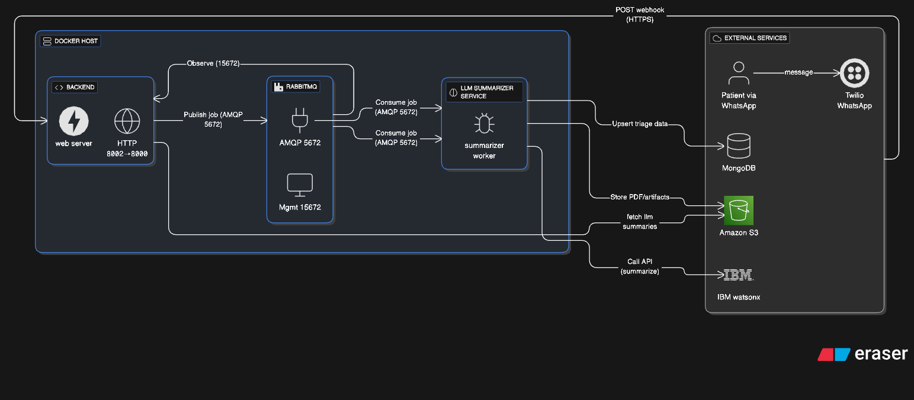

# Triage AI – Architecture Overview (Markdown Guide)

This document explains the block diagram you shared, the purpose of each component, how data flows through the system, and the key design decisions behind the architecture.

---

## 1) High-level summary

**Goal:** automate clinical triage over WhatsApp.
**How it works:** a WhatsApp message reaches our **Backend** via **Twilio** webhooks. The Backend validates/parses the message and **publishes a job** to **RabbitMQ**. The **LLM Summarizer Service** **consumes** the job, calls **IBM watsonx** to generate structured triage + summaries, then **stores** artifacts (PDFs) in **Amazon S3** and triage records in **MongoDB/DocumentDB**. Optional reads/updates from the Backend complete the loop (e.g., status queries, confirmations, clinician views).

---

## 2) Components (what each box does)

### A. Docker Host (Compose network)

**Backend (API & Webhook)**

* Receives **HTTPS POST** webhooks from Twilio (WhatsApp messages).
* Validates/normalizes payloads; handles routing and basic business logic.
* **Publishes** triage jobs to RabbitMQ (AMQP **5672**).
* (Optional) Reads/writes to Mongo/DocDB for session/state/history.
* Exposed on host **8002 → container 8000**; dev debugging via **5678**.

**RabbitMQ (Broker + Management)**

* Reliable queueing for asynchronous work.
* AMQP on **5672**; Management UI on **15672** (observe exchanges/queues).
* Healthcheck gates service start to ensure the broker is ready before dependents.

**LLM Summarizer Service (Worker)**

* **Consumes** jobs from RabbitMQ.
* Calls **IBM watsonx** to transform raw form answers/text into:

  * A **structured triage JSON** (clinically relevant fields).
  * A **human-readable summary**.
* **Stores** PDFs/artifacts to **S3** and **upserts** triage records into **Mongo/DocDB**.
* Dev debugging via **5679 → container 5678**.

> Note: Both services mount `${HOME}/.aws -> /home/app/.aws:ro` for AWS credentials (read-only) and use `extra_hosts` to resolve the DocDB hostname in local/dev contexts.

### B. External Services

**Twilio (WhatsApp)**

* Inbound: sends webhook payloads to Backend.
* Outbound: Backend can reply via Twilio’s API.

**MongoDB / AWS DocumentDB**

* Operational data store for triage records, message state, and audit trails.
* Address: `${MONGO_HOST}:${MONGO_PORT}` with `${MONGO_AUTH_DB}`.

**Amazon S3**

* Durable, cheap storage for generated PDFs and other artifacts.
* Bucket: `${S3_BUCKET_NAME}`.

**IBM watsonx**

* LLM inference for summarization and structured extraction.
* Configured by `${IBM_CLOUD_API_KEY}` and `${IBM_WATSONX_PROJECT_ID}`.

---

## 3) End-to-end data flow (what each arrow means)

1. **Patient (WhatsApp)** → **Twilio**: user sends a message.
2. **Twilio** → **Backend**: webhook **POST (HTTPS)** with message content and metadata.
3. **Backend** → **RabbitMQ**: **Publish job** to exchange `${RABBITMQ_EXCHANGE_NAME}` (type `${RABBITMQ_EXCHANGE_TYPE}`) using `${RABBITMQ_ROUTING_KEY}`; AMQP **5672**.
4. **RabbitMQ** → **LLM Summarizer Service**: **Consume** from `${RABBITMQ_QUEUE_NAME}`.
5. **Summarizer** → **IBM watsonx**: **Call API** to generate the structured triage + summary.
6. **Summarizer** → **S3**: **Store PDFs/artifacts** (e.g., the human-readable summary PDF).
7. **Summarizer** → **Mongo/DocDB**: **Upsert triage data** (JSON payloads, status).
8. *(Optional)* **Backend** ↔ **Mongo/DocDB**: fetch history/state, serve clinician portals, etc.
9. *(Optional)* **RabbitMQ Mgmt (15672)**: **Observe** queues/exchanges for ops and debugging.

---

## 4) Why these design decisions?

### a) **Asynchronous processing with RabbitMQ**

* **Why:** WhatsApp traffic is bursty; LLM calls are variable-latency. A synchronous, request-per-response model would make the webhook handler slow or fragile.
* **Benefits:**

  * **Back-pressure & buffering:** prevents overload during spikes.
  * **Reliability:** retries/dead-lettering possible without losing messages.
  * **Scalability:** horizontally scale the **LLM Summarizer** independently of the **Backend**.

### b) **Separation of concerns (Backend vs Worker)**

* **Why:** clearly split I/O-bound webhook/API logic from CPU/LLM-bound summarization.
* **Benefits:** smaller, focused services; independent deploy/restart; easier performance tuning; reduced blast radius on failures.

### c) **LLM offload to IBM watsonx**

* **Why:** managed, enterprise-grade LLM runtime with project scoping and quotas; centralizes model lifecycle and governance.
* **Benefits:** faster iteration on prompts/models; observability; easier to audit.

### d) **S3 for artifacts (PDFs)**

* **Why:** immutable, cheap, durable storage with simple URLs and lifecycle policies.
* **Benefits:** artifacts can be shared with clinicians; storage scales independently from compute/DB.

### e) **MongoDB/DocumentDB for triage records**

* **Why:** schema-flexible store fits evolving triage schemas; easy to model nested/irregular fields.
* **Benefits:** rapid iteration on the structured triage format; good for event-style records.

### f) **Docker Compose for local/dev parity**

* **Why:** reproducible environment, fast onboarding, consistent ports/healthchecks.
* **Benefits:** fewer “works on my machine” bugs; predictable network aliases; easy to add/remove services (e.g., `mongo-express` is already prepared but commented).

### g) **Healthchecks & `depends_on`**

* **Why:** start order and readiness matter for message brokers and consumers.
* **Benefits:** prevents race conditions (workers connect only after RabbitMQ is healthy).

### h) **Debugpy ports (5678/5679)**

* **Why:** first-class debugging in containers.
* **Benefits:** step-through LLM logic and webhook handling safely in dev.

### i) **JSON-encoded config vars (`TRIAGE_AI_*`)**

* **Why:** group structured connection settings into a single env var per subsystem.
* **Benefits:** **12-Factor** friendly, easier injection/validation, fewer scattered envs.

### j) **RabbitMQ Management (15672) visibility**

* **Why:** operational insight into queues/exchanges/consumers is critical.
* **Benefits:** quick triage of backlogs, stuck consumers, misrouted messages.
* **Security note:** protect **15672** with network policies/VPN/reverse proxy auth; do not expose publicly.

---

## 5) Security & ops considerations (how to run this safely)

* **Secrets:** load via env/secret managers; avoid baking into images. Keep `${HOME}/.aws` **read-only** as configured.
* **Network:** restrict inbound to the Backend’s public endpoint (for Twilio). Lock down **15672** to an internal network/VPN.
* **Mongo/DocDB:** enforce TLS, strong users/roles; restrict by IP allowlist or private endpoints.
* **S3:** bucket policies with least privilege; server-side encryption (SSE-S3/SSE-KMS).
* **Idempotency:** webhook and consumer should tolerate retries (e.g., dedupe keys per message SID).
* **Observability:** add metrics for queue depth, consumer lag, LLM latency, error rates; structured logs with correlation IDs (Twilio SID → job ID → PDF key).
* **Scaling:** add more **LLM Summarizer** replicas when queue depth grows; keep Backend lean to maintain fast webhook responses.

---

## 6) How this architecture serves automated triage

* **Fast patient experience:** webhooks return quickly; heavy work is offloaded.
* **Robust under load:** queues smooth spikes; workers scale out.
* **Clinician-ready outputs:** standardized **structured triage JSON** + **PDF summaries** in S3.
* **Auditability:** persistent records in Mongo/DocDB; artifacts are immutable.
* **Evolvability:** prompts/models can change without touching the webhook/API surface.
* **Operational clarity:** RabbitMQ Mgmt and logs give visibility across the pipeline.

---

## 7) Ports & mappings (from the diagram)

* **Backend:** `8002 → 8000` (HTTP), `5678` (debugpy)
* **LLM Summarizer:** `5679 → 5678` (debugpy)
* **RabbitMQ:** `5672` (AMQP), `15672` (Management UI)

---

## 8) Future extensions (easy next steps)

* **Dead-letter queue (DLQ):** for poison messages, with alerting.
* **Status callbacks:** notify patients when summaries are ready.
* **Fine-grained schemas:** versioned triage JSON; validation with Pydantic.
* **Access control:** clinician portal with signed S3 URLs for PDFs.
* **Infra as code:** ECS/Kubernetes for production; Terraform for infra repeatability.