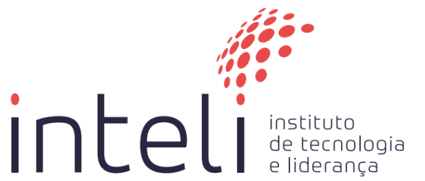

## Summary
1. [Introduction](#1-introduction)  
2. [Sprint 1](#2-sprint-1)  
   - [Project Plan](#-project-plan)  
3. [Sprint 2](#3-sprint-2)  
   - [Value Proposition Canvas](#-value-proposition-canvas)  
   - [Financial Analysis](#-financial-analysis)  
   - [Personas](#-personas)  
   - [Risk Matrix](#-risk-matrix)  
   - [User Stories](#-user-stories)  
4. [Sprint 3](#4-sprint-3)  
   - [Figma Prototype](#-figma-prototype)  
   - [Triage Flow Definition](#-triage-flow-definition)  
5. [Sprint 4](#5-sprint-4)  
   - [User Story Updates](#-user-story-updates)  
   - [Architecture Diagram](#-architecture-diagram)  
   - [Database Modeling](#-database-modeling)  
6. [Sprint 5](#6-sprint-5)  
   - [Project Plan – Module 2](#-project-plan--module-2)  
   - [Public Report – Module 1](#-public-report--module-1)  
7. [Conclusion](#7-conclusion)

------------------------------------------------------------

## 1. Introduction

The increasing demand for medical services in healthcare systems, combined with staff overload and the need for proper case prioritization, motivated the development of this project. Our solution aims to automate the initial triage of patients using a large language model (LLM) based on artificial intelligence, capable of interacting with patients in natural language, collecting information about their symptoms, and prioritizing cases according to severity. This delivery represents the first part of one of the four academic modules we will complete throughout the year and was structured into five sprints, each lasting two weeks.

## 2. Sprint 1

### • Project Plan  
During Sprint 1, our group focused on designing and planning the project as a whole. We created a document called the “Project Plan,” which served as a guide for our deliveries during the module. In this document, we described the main problem, the objectives of our solution, and our work schedule. It also included a description of the business proposal and anticipated challenges—such as the collection of physical data and user adoption. Finally, we defined the key deliveries for each sprint in a structured timeline, which helped guide us through the following development phases.

## 3. Sprint 2

### • Value Proposition Canvas  
We developed the Value Proposition Canvas to map the main pains, gains, and user needs, aligning them with our system’s value proposition. We highlighted the reduction in triage time, the decrease in nurse workload, and improvements in patient experience as key benefits. Core elements included process automation, the use of IBM Watson for data collection, and the generation of structured clinical reports. We also pointed out current issues such as prolonged waiting times and manual data collection, which the system aims to solve.

### • Financial Analysis  
In our financial analysis, we compared the traditional triage model with our proposed solution. We considered the cost of having nurses dedicated solely to triage, which is both time-consuming and resource-intensive. With automation, these costs would drop significantly, as the system would operate continuously with minimal human intervention. We also analyzed operational costs such as infrastructure and IBM Watson API usage. Even factoring in these, the financial outcome remained positive. In short, despite initial investment, hospitals would save money in the medium term, both in staff hours and efficiency—strengthening our proposal as a viable and scalable solution.

### • Personas  
We created three personas to represent the main users of the system: a patient, a healthcare professional, and a hospital manager. These personas were built based on what we envisioned as typical behaviors and needs in a hospital environment. The goal was to use these representations to guide the development of our solution, thinking about how each type of user would interact with the system and what they would expect from it.

### • Risk Matrix  
We created a risk matrix to identify the main challenges our project might face. We mapped risks such as users not adapting to the tool, technical failures, and legal issues related to handling sensitive data. For each risk, we outlined preventive or corrective measures. This exercise helped us think realistically about the project, anticipating possible problems before they arise.

### • User Stories  
Our group wrote several user stories to help structure the system from a user-centered perspective. We considered situations like a patient interacting with the chatbot, a doctor receiving the triage report, and integration with hospital systems. These stories served as the foundation for organizing the backlog and planning the work in future sprints, turning ideas into actionable development tasks.

## 4. Sprint 3

### • Figma Prototype  
In this sprint, our group developed the first visual prototype of the application using Figma. We simulated how the patient would interact with the triage chatbot. The focus was on creating a simple, clear, and fluid low-fidelity interface. We worked on both the conversational flow and the visual layout, aiming for intuitive navigation.

### • Triage Flow Definition  
We also developed a document called the *Triage Summary*, which defines the logic behind the triage flow conducted by the AI. This flow starts with general questions and narrows down based on the patient's responses. We designed it to ensure efficient and secure data collection without overwhelming the patient with repetitive questions. The flow was based on clinical best practices and inspired by real-world triage protocols, serving as the foundation for the backend implementation.

## 5. Sprint 4

### • User Story Updates  
In this sprint, we reviewed and expanded our user stories based on the feedback from previous sprints. We reorganized the stories to focus on core features for the MVP, clearly separating what was essential from what could be added later. We also detailed interactions such as patient-chatbot communication, authentication flows, and how doctors would access the generated reports. This refinement helped align the team and clarified the delivery expectations for each system component.

### • Architecture Diagram  
We developed a technical architecture diagram showing how the main components are connected: the front end (where patients interact with the chatbot), the back end (which processes the data), the AI model (which handles triage), and the database (where everything is stored). This visual representation helped us better understand the division of responsibilities and how to ensure scalability and data security. It also laid out how future integrations with hospital systems might happen.

### • Database Modeling  
Lastly, we created the database diagram using MongoDB. Since the system deals with dynamic patient information, we chose a flexible structure. Data was organized into separate collections for patients, triage records, and reports. This design allows efficient queries and ensures data is stored securely. The model was also built with LGPD compliance in mind, ensuring protection of all sensitive health information.

## 6. Sprint 5

### • Project Plan – Module 2  
In Sprint 5, our focus shifted to planning the next phase of the project. We created a new project plan specifically for Module 2, outlining the general objective for the next stage of development and the planned deliveries. The plan also included a sprint-based schedule aligned with the construction and validation of the MVP. This structure will guide us moving forward, ensuring our team remains aligned across product, design, business, and technology.

### • Public Report – Module 1  
This public report was one of the main deliverables of Sprint 5. It consolidates everything we accomplished throughout Module 1—this document itself. It brings together the outcomes of all previous sprints, explaining the project's evolution, the decisions we made, what we learned, and how each step contributed to shaping the final solution. This report is a key document for anyone seeking to understand what the project is about, where we are, and where we're headed next.

## 7. Conclusion

Throughout the first module, our group was able to structure and validate the foundation of our hospital triage automation project using LLMs. We went through all the essential stages of ideation, validation, and technical definition, delivering components that built a strong vision of the product. With each sprint, we not only deepened our understanding of the problem but also gained clarity on how our solution can positively impact healthcare systems. Planning for the second module has already begun, with clear goals and a strong focus on building a functional and scalable MVP.
