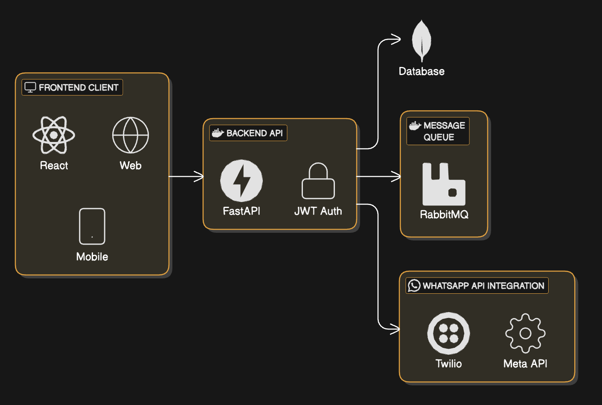

# 🏗️ Backend Architecture Justification for Triage System

The architecture for the triage system has been thoughtfully designed to prioritize **portability**, **scalability**, and **cloud-agnostic deployment**, aligning with the needs of dynamic healthcare environments such as hospitals. Below is a breakdown of the architectural decisions and the rationale behind each component.

---

## 1. Docker-Based Microservice Architecture

We use Docker to containerize the backend services, ensuring the entire system can run reliably across different environments. This design makes the application highly **portable**, which is essential when integrating with varying hospital infrastructures. It also simplifies deployment on cloud platforms such as IBM Cloud or AWS.

---

## 2. Backend API (FastAPI)

The core of the system is a FastAPI service:

- Fast, modern Python web framework suitable for microservices.
- Enables creation of well-documented RESTful APIs for handling triage forms, users, and system interactions.
- Designed for asynchronous processing, which supports efficient handling of concurrent requests such as WhatsApp message sends and form submissions.

---

## 3. MongoDB as the Primary Database

MongoDB was chosen due to its:

- **Schema flexibility**, which is beneficial in the context of dynamic triage forms that may vary between hospitals or evolve over time.
- **Ease of integration** with modern backend stacks and Docker.
- Compatibility with both IBM Cloud Databases and AWS DocumentDB, simplifying future migrations.

---

## 4. RabbitMQ for Asynchronous Messaging (Planned for Scaling Phase)

Although the initial version of the system will operate without a message queue, we plan to introduce **RabbitMQ** as the system scales. This component will decouple resource-intensive tasks such as:

- Sending WhatsApp messages.
- Processing patient replies or scoring logic.

By introducing the message queue in a later phase, we keep the system lightweight during early iterations while enabling future **scalability** and **resilience** when usage increases.

---

## 5. WhatsApp Integration (e.g., Meta API or Twilio)

The system integrates with WhatsApp through providers like Meta’s Business API or Twilio. This allows:

- Automated communication with patients.
- Efficient follow-ups for triage or remote assessments.

Message logs and statuses can be persisted in MongoDB for auditing and traceability.

---

## 6. Modular Codebase Structure

The codebase is modularized to separate concerns:

- `routes/` handle API endpoints.
- `schemas.py` defines data models for validation.
- `database.py` abstracts MongoDB connection logic.
- `whatsapp.py` encapsulates third-party messaging logic.

This modularity makes the system **maintainable** and **extensible**.

---

## 7. Cloud Provider Flexibility via Terraform

To accommodate deployment on both **IBM Cloud initially** and **AWS in the future**, the architecture is designed to be **cloud-agnostic**:

- Infrastructure will be defined using Terraform, allowing consistent and automated provisioning across providers.
- Services such as VMs, VPCs, databases, and queues can be abstracted into reusable modules.
- This reduces vendor lock-in and enables a **smooth cloud transition** when the time comes.

---

## 8. Kubernetes for Future Orchestration (Optional)

As the system grows and traffic increases, we plan to introduce **Kubernetes** as a container orchestration layer. Kubernetes will help:

- Manage container scaling automatically.
- Handle service discovery and load balancing.
- Improve deployment reliability and fault tolerance.

Initially, Docker Compose will suffice for local and small-scale deployments, with Kubernetes reserved for higher scalability needs.

---

## ✅ Summary of Benefits

- **Portability**: Fully containerized with Docker and orchestration-ready.
- **Scalability**: Designed to scale incrementally with RabbitMQ and Kubernetes.
- **Flexibility**: MongoDB schema-less design and modular code allow easy adaptation.
- **Cloud Independence**: Terraform-based infrastructure supports multi-cloud strategy.
- **Compliance-Friendly**: Design allows for logging, auditing, and secure communication.
