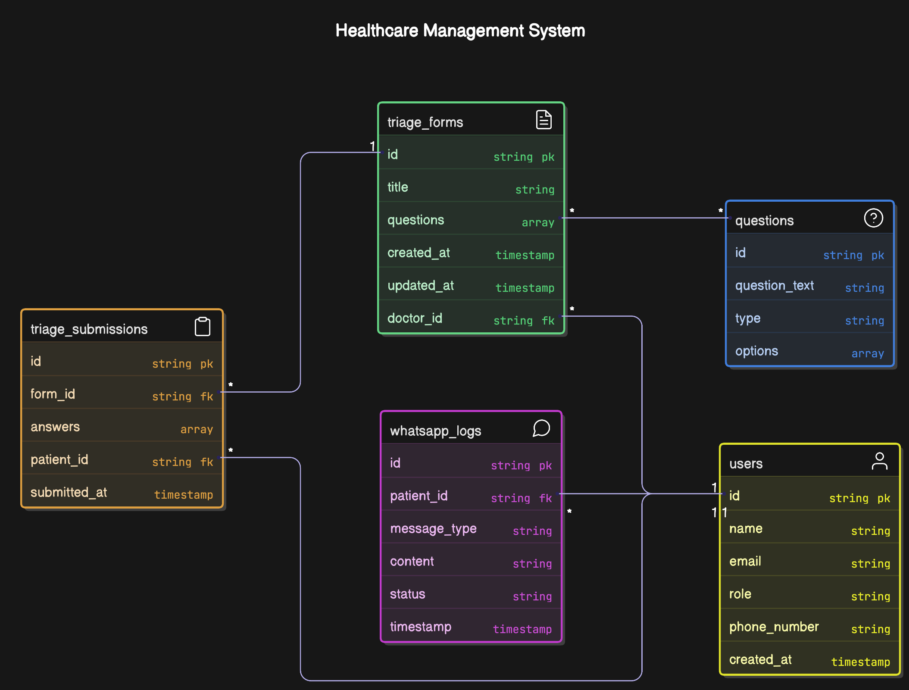

# 🧠 Database Schema Design Justification (MongoDB)

This document outlines the rationale behind the MongoDB schema design for the triage backend system. The database structure balances **flexibility**, **performance**, and **scalability**, while supporting the current and future needs of doctors and patients.

[](./img/database_diagram.png)

---

## 📦 NoSQL Approach with MongoDB

MongoDB is a document-based NoSQL database. It is chosen for this system because:

- Triage forms and their questions may evolve over time and vary per doctor.
- Patients' answers can be stored as nested data without requiring rigid relational modeling.
- High flexibility in how we store and query semi-structured health data.
- Excellent support in both IBM Cloud and AWS, aiding cloud portability.

---

## `Collections`

```json
{
  _id: ObjectId,
  name: String,
  email: String,
  role: "doctor" | "patient",
  phone_number: String,
  created_at: Date
},

{
  _id: ObjectId,
  doctor_id: ObjectId (ref to users),
  title: String,
  questions: [Embedded Array or Question References],
  created_at: Date,
  updated_at: Date
},
{
  _id: ObjectId,
  question_text: String,
  type: "text" | "radio" | "checkbox",
  options: [String]
},
{
  _id: ObjectId,
  form_id: ObjectId (ref to triage_forms),
  patient_id: ObjectId (ref to users),
  answers: [Array of Answers],
  submitted_at: Date
},
{
  _id: ObjectId,
  patient_id: ObjectId (ref to users),
  message_type: "sent" | "received",
  content: String,
  status: "pending" | "delivered" | "read",
  timestamp: Date
}
```
